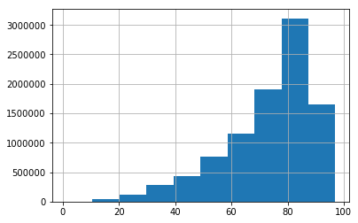
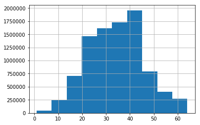
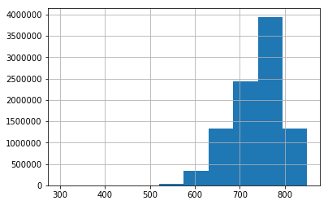
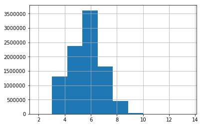
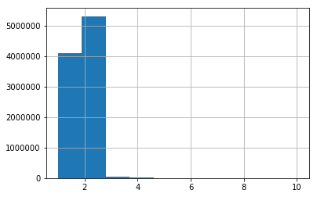
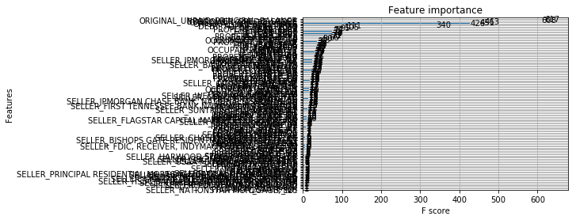
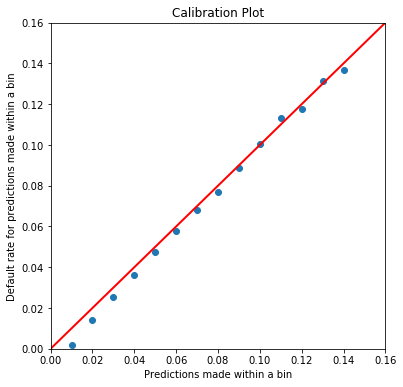
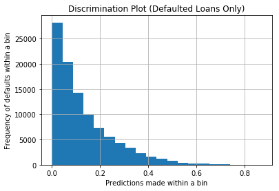
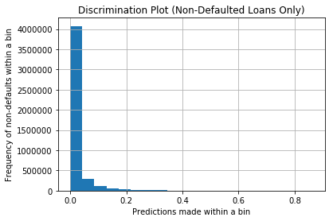

# Import packages


```python
import numpy as np 
import pandas as pd 
from sklearn.preprocessing import Imputer
from sklearn.model_selection import train_test_split
from sklearn.metrics import brier_score_loss
from sklearn.tree import DecisionTreeClassifier 
from sklearn.linear_model import LogisticRegression
from sklearn.ensemble import RandomForestClassifier
import xgboost as xgb
%matplotlib inline 
import matplotlib.pyplot as plt  
import time
```


```python
# Load the data 
```

This load will take a half minute or so. The competition dataset is a 40% random sample of the 23,634,219 loans Fannie acquired from 2000 Q1 to 2015 Q3. The first 20% are training set rows and the the second 20% are testing set rows. See the last column call 'is_Set'.


```python
load_starts = time.time()
df = pd.read_csv('FannieDataVMCompetition.csv', sep='|') 
time.time() - load_starts
```


    27.348472595214844


```python
df.head()
```


<div>
<style>
    .dataframe thead tr:only-child th {
        text-align: right;
    }

    .dataframe thead th {
        text-align: left;
    }

    .dataframe tbody tr th {
        vertical-align: top;
    }
</style>
<table border="1" class="dataframe">
  <thead>
    <tr style="text-align: right;">
      <th></th>
      <th>LOAN_IDENTIFIER</th>
      <th>CHANNEL</th>
      <th>SELLER_NAME</th>
      <th>ORIGINAL_INTEREST_RATE</th>
      <th>ORIGINAL_UNPAID_PRINCIPAL_BALANCE</th>
      <th>ORIGINAL_LOAN_TERM</th>
      <th>ORIGINATION_DATE</th>
      <th>FIRST_PAYMENT_DATE</th>
      <th>ORIGINAL_LOAN_TO_VALUE</th>
      <th>ORIGINAL_COMBINED_LOAN_TO_VALUE</th>
      <th>...</th>
      <th>PRODUCT_TYPE</th>
      <th>CO_BORROWER_CREDIT_SCORE</th>
      <th>MORTGAGE_INSURANCE_TYPE</th>
      <th>METROPOLITAN_STATISTICAL_AREA</th>
      <th>MSA_NAME</th>
      <th>MSA_POPULATION</th>
      <th>ZERO_BALANCE_CODE</th>
      <th>YEAR</th>
      <th>DEFAULT_FLAG</th>
      <th>is_Set</th>
    </tr>
  </thead>
  <tbody>
    <tr>
      <th>0</th>
      <td>731259366993</td>
      <td>R</td>
      <td>BANK OF AMERICA, N.A.</td>
      <td>6.875</td>
      <td>108000.0</td>
      <td>360</td>
      <td>10/2008</td>
      <td>12/2008</td>
      <td>70.0</td>
      <td>70.0</td>
      <td>...</td>
      <td>FRM</td>
      <td>776.0</td>
      <td>NaN</td>
      <td>31080</td>
      <td>Los Angeles-Long Beach-Anaheim, CA</td>
      <td>12828837.0</td>
      <td>NaN</td>
      <td>2008</td>
      <td>0</td>
      <td>train</td>
    </tr>
    <tr>
      <th>1</th>
      <td>378253318765</td>
      <td>R</td>
      <td>OTHER</td>
      <td>4.000</td>
      <td>168000.0</td>
      <td>360</td>
      <td>06/2015</td>
      <td>08/2015</td>
      <td>73.0</td>
      <td>73.0</td>
      <td>...</td>
      <td>FRM</td>
      <td>687.0</td>
      <td>NaN</td>
      <td>28140</td>
      <td>Kansas City, MO-KS</td>
      <td>2009342.0</td>
      <td>NaN</td>
      <td>2015</td>
      <td>0</td>
      <td>train</td>
    </tr>
    <tr>
      <th>2</th>
      <td>741859238541</td>
      <td>C</td>
      <td>GMAC MORTGAGE, LLC</td>
      <td>6.500</td>
      <td>140000.0</td>
      <td>360</td>
      <td>08/2008</td>
      <td>10/2008</td>
      <td>85.0</td>
      <td>85.0</td>
      <td>...</td>
      <td>FRM</td>
      <td>767.0</td>
      <td>1.0</td>
      <td>44180</td>
      <td>Springfield, MO</td>
      <td>436712.0</td>
      <td>1.0</td>
      <td>2008</td>
      <td>0</td>
      <td>train</td>
    </tr>
    <tr>
      <th>3</th>
      <td>382868191590</td>
      <td>R</td>
      <td>OTHER</td>
      <td>4.000</td>
      <td>356000.0</td>
      <td>360</td>
      <td>03/2015</td>
      <td>05/2015</td>
      <td>75.0</td>
      <td>75.0</td>
      <td>...</td>
      <td>FRM</td>
      <td>NaN</td>
      <td>NaN</td>
      <td>47900</td>
      <td>Washington-Arlington-Alexandria, DC-VA-MD-WV</td>
      <td>5636232.0</td>
      <td>NaN</td>
      <td>2015</td>
      <td>0</td>
      <td>train</td>
    </tr>
    <tr>
      <th>4</th>
      <td>180085005240</td>
      <td>C</td>
      <td>AMTRUST BANK</td>
      <td>7.250</td>
      <td>121000.0</td>
      <td>360</td>
      <td>03/2001</td>
      <td>05/2001</td>
      <td>84.0</td>
      <td>84.0</td>
      <td>...</td>
      <td>FRM</td>
      <td>NaN</td>
      <td>1.0</td>
      <td>39300</td>
      <td>Providence-Warwick, RI-MA</td>
      <td>1600852.0</td>
      <td>1.0</td>
      <td>2001</td>
      <td>0</td>
      <td>train</td>
    </tr>
  </tbody>
</table>
<p>5 rows × 31 columns</p>
</div>


```python
df.shape
```


    (9453687, 31)


```python
df['is_Set'].value_counts()
```


    test     4726844
    train    4726843
    Name: is_Set, dtype: int64


```python
n_train = df['is_Set'].value_counts()[1]
n_train
```


    4726843


# Summarize the data

The data frame below summarizes some important information about the columns in our dataset. This summary data frame is the concatenation of four other data frames: (1) variable name, (2) the variable's data type, (3) the number of unique values in the variable's column, and (4) number of nulls in the variable's column. 

We explore the data type of each variable to see if we need to change the data type before doing any more work. We investigate the number of nulls (or missing values) for each variable to see which of the variables need imputation work. We explore the number of unique values in each variable's column to see which variables need to become dummy variables. 


```python
summary_df = pd.concat([pd.DataFrame(df.columns), pd.DataFrame(df.dtypes.reshape(-1,1)),
                        pd.DataFrame(df.isnull().sum().values), pd.DataFrame([df[name].nunique() for name in df.columns])],
                       axis=1)
summary_df.columns = ['Variable Name', 'Data Type', 'Nulls', 'Unique Values']
summary_df
```

    /usr/local/anaconda/lib/python3.6/site-packages/ipykernel_launcher.py:1: FutureWarning: reshape is deprecated and will raise in a subsequent release. Please use .values.reshape(...) instead
      """Entry point for launching an IPython kernel.


<div>
<style>
    .dataframe thead tr:only-child th {
        text-align: right;
    }

    .dataframe thead th {
        text-align: left;
    }

    .dataframe tbody tr th {
        vertical-align: top;
    }
</style>
<table border="1" class="dataframe">
  <thead>
    <tr style="text-align: right;">
      <th></th>
      <th>Variable Name</th>
      <th>Data Type</th>
      <th>Nulls</th>
      <th>Unique Values</th>
    </tr>
  </thead>
  <tbody>
    <tr>
      <th>0</th>
      <td>LOAN_IDENTIFIER</td>
      <td>int64</td>
      <td>0</td>
      <td>9453687</td>
    </tr>
    <tr>
      <th>1</th>
      <td>CHANNEL</td>
      <td>object</td>
      <td>0</td>
      <td>3</td>
    </tr>
    <tr>
      <th>2</th>
      <td>SELLER_NAME</td>
      <td>object</td>
      <td>0</td>
      <td>72</td>
    </tr>
    <tr>
      <th>3</th>
      <td>ORIGINAL_INTEREST_RATE</td>
      <td>float64</td>
      <td>4</td>
      <td>3802</td>
    </tr>
    <tr>
      <th>4</th>
      <td>ORIGINAL_UNPAID_PRINCIPAL_BALANCE</td>
      <td>float64</td>
      <td>0</td>
      <td>984</td>
    </tr>
    <tr>
      <th>5</th>
      <td>ORIGINAL_LOAN_TERM</td>
      <td>int64</td>
      <td>0</td>
      <td>60</td>
    </tr>
    <tr>
      <th>6</th>
      <td>ORIGINATION_DATE</td>
      <td>object</td>
      <td>0</td>
      <td>201</td>
    </tr>
    <tr>
      <th>7</th>
      <td>FIRST_PAYMENT_DATE</td>
      <td>object</td>
      <td>0</td>
      <td>202</td>
    </tr>
    <tr>
      <th>8</th>
      <td>ORIGINAL_LOAN_TO_VALUE</td>
      <td>float64</td>
      <td>3</td>
      <td>97</td>
    </tr>
    <tr>
      <th>9</th>
      <td>ORIGINAL_COMBINED_LOAN_TO_VALUE</td>
      <td>float64</td>
      <td>100247</td>
      <td>160</td>
    </tr>
    <tr>
      <th>10</th>
      <td>NUMBER_OF_BORROWERS</td>
      <td>float64</td>
      <td>2577</td>
      <td>10</td>
    </tr>
    <tr>
      <th>11</th>
      <td>DEBT_TO_INCOME_RATIO</td>
      <td>float64</td>
      <td>212715</td>
      <td>64</td>
    </tr>
    <tr>
      <th>12</th>
      <td>BORROWER_CREDIT_SCORE</td>
      <td>float64</td>
      <td>46082</td>
      <td>482</td>
    </tr>
    <tr>
      <th>13</th>
      <td>FIRST_TIME_HOME_BUYER_INDICATOR</td>
      <td>object</td>
      <td>0</td>
      <td>3</td>
    </tr>
    <tr>
      <th>14</th>
      <td>LOAN_PURPOSE</td>
      <td>object</td>
      <td>0</td>
      <td>4</td>
    </tr>
    <tr>
      <th>15</th>
      <td>PROPERTY_TYPE</td>
      <td>object</td>
      <td>0</td>
      <td>5</td>
    </tr>
    <tr>
      <th>16</th>
      <td>NUMBER_OF_UNITS</td>
      <td>int64</td>
      <td>0</td>
      <td>4</td>
    </tr>
    <tr>
      <th>17</th>
      <td>OCCUPANCY_STATUS</td>
      <td>object</td>
      <td>0</td>
      <td>3</td>
    </tr>
    <tr>
      <th>18</th>
      <td>PROPERTY_STATE</td>
      <td>object</td>
      <td>0</td>
      <td>54</td>
    </tr>
    <tr>
      <th>19</th>
      <td>ZIP_3_DIGIT</td>
      <td>int64</td>
      <td>0</td>
      <td>990</td>
    </tr>
    <tr>
      <th>20</th>
      <td>MORTGAGE_INSURANCE_PERCENTAGE</td>
      <td>float64</td>
      <td>7486290</td>
      <td>43</td>
    </tr>
    <tr>
      <th>21</th>
      <td>PRODUCT_TYPE</td>
      <td>object</td>
      <td>0</td>
      <td>1</td>
    </tr>
    <tr>
      <th>22</th>
      <td>CO_BORROWER_CREDIT_SCORE</td>
      <td>float64</td>
      <td>4935642</td>
      <td>451</td>
    </tr>
    <tr>
      <th>23</th>
      <td>MORTGAGE_INSURANCE_TYPE</td>
      <td>float64</td>
      <td>7486290</td>
      <td>2</td>
    </tr>
    <tr>
      <th>24</th>
      <td>METROPOLITAN_STATISTICAL_AREA</td>
      <td>int64</td>
      <td>0</td>
      <td>405</td>
    </tr>
    <tr>
      <th>25</th>
      <td>MSA_NAME</td>
      <td>object</td>
      <td>1278053</td>
      <td>381</td>
    </tr>
    <tr>
      <th>26</th>
      <td>MSA_POPULATION</td>
      <td>float64</td>
      <td>1278053</td>
      <td>381</td>
    </tr>
    <tr>
      <th>27</th>
      <td>ZERO_BALANCE_CODE</td>
      <td>float64</td>
      <td>2677799</td>
      <td>4</td>
    </tr>
    <tr>
      <th>28</th>
      <td>YEAR</td>
      <td>int64</td>
      <td>0</td>
      <td>17</td>
    </tr>
    <tr>
      <th>29</th>
      <td>DEFAULT_FLAG</td>
      <td>int64</td>
      <td>0</td>
      <td>2</td>
    </tr>
    <tr>
      <th>30</th>
      <td>is_Set</td>
      <td>object</td>
      <td>0</td>
      <td>2</td>
    </tr>
  </tbody>
</table>
</div>


```python
df['DEFAULT_FLAG'].sum()
```


    201067


# Impute missing values

Let's impute missing values of non-categorical variables. We will use the mean of non-missing values of that variable as the filled-in value. To start, we impute for missing values in ORIGINAL_LOAN_TO_VALUE, DEBT_TO_INCOME_RATIO, and BORROWER_CREDIT_SCORE. Note that a variable such as NUMBER_OF_BORROWERS can be treated as a categorical variable. For a categorical variable a missing value will be treated as its own category, with its own dummy variable. After imputation, we create dummy variables. 

Impute ORIGINAL_LOAN_TO_VALUE.


```python
np.mean(df['ORIGINAL_LOAN_TO_VALUE'])
```


    72.94526683989014


```python
df['ORIGINAL_LOAN_TO_VALUE'].hist()
```


    <matplotlib.axes._subplots.AxesSubplot at 0x7f52601a2940>





```python
fill_NaN = Imputer(missing_values=np.nan, strategy='mean', axis=0)
```


```python
fill_median = Imputer(missing_values=np.nan, strategy='median', axis=0)
```


```python
df['ORIGINAL_LOAN_TO_VALUE'] = fill_NaN.fit_transform(pd.DataFrame(df['ORIGINAL_LOAN_TO_VALUE']))
```

Impute DEBT_TO_INCOME_RATIO.


```python
np.mean(df['DEBT_TO_INCOME_RATIO'])
```


    34.32230018660375


```python
df['DEBT_TO_INCOME_RATIO'].hist()
```


    <matplotlib.axes._subplots.AxesSubplot at 0x7f52601a2128>





```python
df['DEBT_TO_INCOME_RATIO'] = fill_NaN.fit_transform(pd.DataFrame(df['DEBT_TO_INCOME_RATIO']))
```

Impute BORROWER_CREDIT_SCORE.


```python
np.mean(df['BORROWER_CREDIT_SCORE'])
```


    737.9807289953181


```python
df['BORROWER_CREDIT_SCORE'].hist()
```


    <matplotlib.axes._subplots.AxesSubplot at 0x7f525ec717f0>





```python
df['BORROWER_CREDIT_SCORE'] = fill_NaN.fit_transform(pd.DataFrame(df['BORROWER_CREDIT_SCORE']))
```

After imputation, go back up and run the df_summary cell.


```python
np.mean(df['ORIGINAL_INTEREST_RATE'])
```


    5.6458593319698664


```python
df['ORIGINAL_INTEREST_RATE'].hist()
```


    <matplotlib.axes._subplots.AxesSubplot at 0x7f525ebd34e0>





```python
df['ORIGINAL_INTEREST_RATE'] = fill_NaN.fit_transform(pd.DataFrame(df['ORIGINAL_INTEREST_RATE']))
```


```python
#Imputing for Number of borrowers
```


```python
df['NUMBER_OF_BORROWERS'].median()
```


    2.0


```python
df['NUMBER_OF_BORROWERS'].hist()
```


    <matplotlib.axes._subplots.AxesSubplot at 0x7f525eb0b588>





```python
df['NUMBER_OF_BORROWERS'] = fill_median.fit_transform(pd.DataFrame(df['NUMBER_OF_BORROWERS']))
```

# Create dummies

Candidates for dummy variables are categorical variables such as CHANNEL, NUMBER_OF_BORROWERS, and YEAR. A variable is a candidate for dummies if it takes on few levels and/or it is not ordered in any natural way. To get started, we create dummy variables for these variables. After we look at the loan counts by level, we create dummies and append them to the new data frame.

CHANNEL dummies


```python
df['CHANNEL'].value_counts(dropna=False)
```


    R    4338400
    C    3520486
    B    1594801
    Name: CHANNEL, dtype: int64


```python
dummies_CHANNEL = pd.get_dummies(df['CHANNEL'])
dummies_CHANNEL.columns = ['is_CHANNEL_' + str(col) for col in dummies_CHANNEL.columns]
dummies_CHANNEL.head()
```


<div>
<style>
    .dataframe thead tr:only-child th {
        text-align: right;
    }

    .dataframe thead th {
        text-align: left;
    }

    .dataframe tbody tr th {
        vertical-align: top;
    }
</style>
<table border="1" class="dataframe">
  <thead>
    <tr style="text-align: right;">
      <th></th>
      <th>is_CHANNEL_B</th>
      <th>is_CHANNEL_C</th>
      <th>is_CHANNEL_R</th>
    </tr>
  </thead>
  <tbody>
    <tr>
      <th>0</th>
      <td>0</td>
      <td>0</td>
      <td>1</td>
    </tr>
    <tr>
      <th>1</th>
      <td>0</td>
      <td>0</td>
      <td>1</td>
    </tr>
    <tr>
      <th>2</th>
      <td>0</td>
      <td>1</td>
      <td>0</td>
    </tr>
    <tr>
      <th>3</th>
      <td>0</td>
      <td>0</td>
      <td>1</td>
    </tr>
    <tr>
      <th>4</th>
      <td>0</td>
      <td>1</td>
      <td>0</td>
    </tr>
  </tbody>
</table>
</div>


NUMBER_OF_BORROWERS dummies


```python
df['NUMBER_OF_BORROWERS'].value_counts(dropna=False)
```


    2.0     5310306
    1.0     4091533
    3.0       38893
    4.0       12548
    5.0         187
    6.0         155
    8.0          27
    7.0          26
    10.0          9
    9.0           3
    Name: NUMBER_OF_BORROWERS, dtype: int64


```python
dummies_BORROWERS = pd.get_dummies(df['NUMBER_OF_BORROWERS'])
dummies_BORROWERS.columns = ['Borrowers_is_' + str(col) for col in dummies_BORROWERS.columns]
dummies_BORROWERS.head()
```


<div>
<style>
    .dataframe thead tr:only-child th {
        text-align: right;
    }

    .dataframe thead th {
        text-align: left;
    }

    .dataframe tbody tr th {
        vertical-align: top;
    }
</style>
<table border="1" class="dataframe">
  <thead>
    <tr style="text-align: right;">
      <th></th>
      <th>Borrowers_is_1.0</th>
      <th>Borrowers_is_2.0</th>
      <th>Borrowers_is_3.0</th>
      <th>Borrowers_is_4.0</th>
      <th>Borrowers_is_5.0</th>
      <th>Borrowers_is_6.0</th>
      <th>Borrowers_is_7.0</th>
      <th>Borrowers_is_8.0</th>
      <th>Borrowers_is_9.0</th>
      <th>Borrowers_is_10.0</th>
    </tr>
  </thead>
  <tbody>
    <tr>
      <th>0</th>
      <td>0</td>
      <td>1</td>
      <td>0</td>
      <td>0</td>
      <td>0</td>
      <td>0</td>
      <td>0</td>
      <td>0</td>
      <td>0</td>
      <td>0</td>
    </tr>
    <tr>
      <th>1</th>
      <td>0</td>
      <td>1</td>
      <td>0</td>
      <td>0</td>
      <td>0</td>
      <td>0</td>
      <td>0</td>
      <td>0</td>
      <td>0</td>
      <td>0</td>
    </tr>
    <tr>
      <th>2</th>
      <td>0</td>
      <td>1</td>
      <td>0</td>
      <td>0</td>
      <td>0</td>
      <td>0</td>
      <td>0</td>
      <td>0</td>
      <td>0</td>
      <td>0</td>
    </tr>
    <tr>
      <th>3</th>
      <td>1</td>
      <td>0</td>
      <td>0</td>
      <td>0</td>
      <td>0</td>
      <td>0</td>
      <td>0</td>
      <td>0</td>
      <td>0</td>
      <td>0</td>
    </tr>
    <tr>
      <th>4</th>
      <td>1</td>
      <td>0</td>
      <td>0</td>
      <td>0</td>
      <td>0</td>
      <td>0</td>
      <td>0</td>
      <td>0</td>
      <td>0</td>
      <td>0</td>
    </tr>
  </tbody>
</table>
</div>


We include the argument dummy_na=True in the get_dummies() function to get an extra dummy variable for missing values. We add this argument when we do not feel comfortable imputing such missing values. 


```python

```

YEAR dummies


```python
df['YEAR'].value_counts(dropna=False)
```


    2003    1203684
    2002     956626
    2001     938165
    2009     702281
    2012     682718
    2013     610515
    2010     478743
    2004     476650
    2008     472374
    2005     452498
    2014     436684
    2000     427822
    2007     424844
    2011     401270
    2015     379995
    2006     357860
    1999      50958
    Name: YEAR, dtype: int64


```python
dummies_YEAR = pd.get_dummies(df['YEAR'])
dummies_YEAR.columns = ['is_YEAR_' + str(col) for col in dummies_YEAR.columns]
dummies_YEAR.head()
```


<div>
<style>
    .dataframe thead tr:only-child th {
        text-align: right;
    }

    .dataframe thead th {
        text-align: left;
    }

    .dataframe tbody tr th {
        vertical-align: top;
    }
</style>
<table border="1" class="dataframe">
  <thead>
    <tr style="text-align: right;">
      <th></th>
      <th>is_YEAR_1999</th>
      <th>is_YEAR_2000</th>
      <th>is_YEAR_2001</th>
      <th>is_YEAR_2002</th>
      <th>is_YEAR_2003</th>
      <th>is_YEAR_2004</th>
      <th>is_YEAR_2005</th>
      <th>is_YEAR_2006</th>
      <th>is_YEAR_2007</th>
      <th>is_YEAR_2008</th>
      <th>is_YEAR_2009</th>
      <th>is_YEAR_2010</th>
      <th>is_YEAR_2011</th>
      <th>is_YEAR_2012</th>
      <th>is_YEAR_2013</th>
      <th>is_YEAR_2014</th>
      <th>is_YEAR_2015</th>
    </tr>
  </thead>
  <tbody>
    <tr>
      <th>0</th>
      <td>0</td>
      <td>0</td>
      <td>0</td>
      <td>0</td>
      <td>0</td>
      <td>0</td>
      <td>0</td>
      <td>0</td>
      <td>0</td>
      <td>1</td>
      <td>0</td>
      <td>0</td>
      <td>0</td>
      <td>0</td>
      <td>0</td>
      <td>0</td>
      <td>0</td>
    </tr>
    <tr>
      <th>1</th>
      <td>0</td>
      <td>0</td>
      <td>0</td>
      <td>0</td>
      <td>0</td>
      <td>0</td>
      <td>0</td>
      <td>0</td>
      <td>0</td>
      <td>0</td>
      <td>0</td>
      <td>0</td>
      <td>0</td>
      <td>0</td>
      <td>0</td>
      <td>0</td>
      <td>1</td>
    </tr>
    <tr>
      <th>2</th>
      <td>0</td>
      <td>0</td>
      <td>0</td>
      <td>0</td>
      <td>0</td>
      <td>0</td>
      <td>0</td>
      <td>0</td>
      <td>0</td>
      <td>1</td>
      <td>0</td>
      <td>0</td>
      <td>0</td>
      <td>0</td>
      <td>0</td>
      <td>0</td>
      <td>0</td>
    </tr>
    <tr>
      <th>3</th>
      <td>0</td>
      <td>0</td>
      <td>0</td>
      <td>0</td>
      <td>0</td>
      <td>0</td>
      <td>0</td>
      <td>0</td>
      <td>0</td>
      <td>0</td>
      <td>0</td>
      <td>0</td>
      <td>0</td>
      <td>0</td>
      <td>0</td>
      <td>0</td>
      <td>1</td>
    </tr>
    <tr>
      <th>4</th>
      <td>0</td>
      <td>0</td>
      <td>1</td>
      <td>0</td>
      <td>0</td>
      <td>0</td>
      <td>0</td>
      <td>0</td>
      <td>0</td>
      <td>0</td>
      <td>0</td>
      <td>0</td>
      <td>0</td>
      <td>0</td>
      <td>0</td>
      <td>0</td>
      <td>0</td>
    </tr>
  </tbody>
</table>
</div>


Make a final data frame with all the dummies included.


```python

```


```python
## Dummies for First time home buyer
```


```python
df['FIRST_TIME_HOME_BUYER_INDICATOR'].value_counts(dropna=False)
```


    N    8296801
    Y    1150336
    U       6550
    Name: FIRST_TIME_HOME_BUYER_INDICATOR, dtype: int64


```python
dummies_FIRST_TIME_HOME_BUYER_INDICATOR = pd.get_dummies(df['FIRST_TIME_HOME_BUYER_INDICATOR'])
dummies_FIRST_TIME_HOME_BUYER_INDICATOR.columns = ['is_FirstHome_' + str(col) for col in dummies_FIRST_TIME_HOME_BUYER_INDICATOR.columns]
dummies_FIRST_TIME_HOME_BUYER_INDICATOR.head()
```


<div>
<style>
    .dataframe thead tr:only-child th {
        text-align: right;
    }

    .dataframe thead th {
        text-align: left;
    }

    .dataframe tbody tr th {
        vertical-align: top;
    }
</style>
<table border="1" class="dataframe">
  <thead>
    <tr style="text-align: right;">
      <th></th>
      <th>is_FirstHome_N</th>
      <th>is_FirstHome_U</th>
      <th>is_FirstHome_Y</th>
    </tr>
  </thead>
  <tbody>
    <tr>
      <th>0</th>
      <td>1</td>
      <td>0</td>
      <td>0</td>
    </tr>
    <tr>
      <th>1</th>
      <td>1</td>
      <td>0</td>
      <td>0</td>
    </tr>
    <tr>
      <th>2</th>
      <td>1</td>
      <td>0</td>
      <td>0</td>
    </tr>
    <tr>
      <th>3</th>
      <td>1</td>
      <td>0</td>
      <td>0</td>
    </tr>
    <tr>
      <th>4</th>
      <td>1</td>
      <td>0</td>
      <td>0</td>
    </tr>
  </tbody>
</table>
</div>


```python
#Loan Purpose
```


```python
df['LOAN_PURPOSE'].value_counts(dropna=False)
```


    P    4005164
    R    2895660
    C    2549078
    U       3785
    Name: LOAN_PURPOSE, dtype: int64


```python
dummies_LOAN_PURPOSE = pd.get_dummies(df['LOAN_PURPOSE'])
dummies_LOAN_PURPOSE.columns = ['Loan_Purpose_' + str(col) for col in dummies_LOAN_PURPOSE.columns]
dummies_LOAN_PURPOSE.head()
```


<div>
<style>
    .dataframe thead tr:only-child th {
        text-align: right;
    }

    .dataframe thead th {
        text-align: left;
    }

    .dataframe tbody tr th {
        vertical-align: top;
    }
</style>
<table border="1" class="dataframe">
  <thead>
    <tr style="text-align: right;">
      <th></th>
      <th>Loan_Purpose_C</th>
      <th>Loan_Purpose_P</th>
      <th>Loan_Purpose_R</th>
      <th>Loan_Purpose_U</th>
    </tr>
  </thead>
  <tbody>
    <tr>
      <th>0</th>
      <td>0</td>
      <td>1</td>
      <td>0</td>
      <td>0</td>
    </tr>
    <tr>
      <th>1</th>
      <td>0</td>
      <td>0</td>
      <td>1</td>
      <td>0</td>
    </tr>
    <tr>
      <th>2</th>
      <td>0</td>
      <td>1</td>
      <td>0</td>
      <td>0</td>
    </tr>
    <tr>
      <th>3</th>
      <td>1</td>
      <td>0</td>
      <td>0</td>
      <td>0</td>
    </tr>
    <tr>
      <th>4</th>
      <td>1</td>
      <td>0</td>
      <td>0</td>
      <td>0</td>
    </tr>
  </tbody>
</table>
</div>


```python
# Number of Units
```


```python
df['NUMBER_OF_UNITS'].value_counts(dropna=False)
```


    1    9195759
    2     189864
    3      35366
    4      32698
    Name: NUMBER_OF_UNITS, dtype: int64


```python
dummies_NUMBER_OF_UNITS = pd.get_dummies(df['NUMBER_OF_UNITS'])
dummies_NUMBER_OF_UNITS.columns = ['Units_Number_' + str(col) for col in dummies_NUMBER_OF_UNITS.columns]
dummies_NUMBER_OF_UNITS.head()
```


<div>
<style>
    .dataframe thead tr:only-child th {
        text-align: right;
    }

    .dataframe thead th {
        text-align: left;
    }

    .dataframe tbody tr th {
        vertical-align: top;
    }
</style>
<table border="1" class="dataframe">
  <thead>
    <tr style="text-align: right;">
      <th></th>
      <th>Units_Number_1</th>
      <th>Units_Number_2</th>
      <th>Units_Number_3</th>
      <th>Units_Number_4</th>
    </tr>
  </thead>
  <tbody>
    <tr>
      <th>0</th>
      <td>1</td>
      <td>0</td>
      <td>0</td>
      <td>0</td>
    </tr>
    <tr>
      <th>1</th>
      <td>1</td>
      <td>0</td>
      <td>0</td>
      <td>0</td>
    </tr>
    <tr>
      <th>2</th>
      <td>1</td>
      <td>0</td>
      <td>0</td>
      <td>0</td>
    </tr>
    <tr>
      <th>3</th>
      <td>1</td>
      <td>0</td>
      <td>0</td>
      <td>0</td>
    </tr>
    <tr>
      <th>4</th>
      <td>0</td>
      <td>1</td>
      <td>0</td>
      <td>0</td>
    </tr>
  </tbody>
</table>
</div>


```python
#Occupancy Status
```


```python
df['OCCUPANCY_STATUS'].value_counts(dropna=False)
```


    P    8366280
    I     686957
    S     400450
    Name: OCCUPANCY_STATUS, dtype: int64


```python
dummies_OCCUPANCY_STATUS = pd.get_dummies(df['OCCUPANCY_STATUS'])
dummies_OCCUPANCY_STATUS.columns = ['OCCUPANCY_STATUS_' + str(col) for col in dummies_OCCUPANCY_STATUS.columns]
dummies_OCCUPANCY_STATUS.head()
```


<div>
<style>
    .dataframe thead tr:only-child th {
        text-align: right;
    }

    .dataframe thead th {
        text-align: left;
    }

    .dataframe tbody tr th {
        vertical-align: top;
    }
</style>
<table border="1" class="dataframe">
  <thead>
    <tr style="text-align: right;">
      <th></th>
      <th>OCCUPANCY_STATUS_I</th>
      <th>OCCUPANCY_STATUS_P</th>
      <th>OCCUPANCY_STATUS_S</th>
    </tr>
  </thead>
  <tbody>
    <tr>
      <th>0</th>
      <td>1</td>
      <td>0</td>
      <td>0</td>
    </tr>
    <tr>
      <th>1</th>
      <td>0</td>
      <td>1</td>
      <td>0</td>
    </tr>
    <tr>
      <th>2</th>
      <td>0</td>
      <td>1</td>
      <td>0</td>
    </tr>
    <tr>
      <th>3</th>
      <td>0</td>
      <td>1</td>
      <td>0</td>
    </tr>
    <tr>
      <th>4</th>
      <td>0</td>
      <td>1</td>
      <td>0</td>
    </tr>
  </tbody>
</table>
</div>


```python
#PROPERTY_TYPE 
```


```python
df['PROPERTY_TYPE'].value_counts(dropna=False)
```


    SF    6967045
    PU    1563115
    CO     817478
    CP      53259
    MH      52790
    Name: PROPERTY_TYPE, dtype: int64


```python
dummies_PROPERTY_TYPE = pd.get_dummies(df['PROPERTY_TYPE'])
dummies_PROPERTY_TYPE.columns = ['PROPERTY_TYPE_' + str(col) for col in dummies_PROPERTY_TYPE.columns]
dummies_PROPERTY_TYPE.head()
```


<div>
<style>
    .dataframe thead tr:only-child th {
        text-align: right;
    }

    .dataframe thead th {
        text-align: left;
    }

    .dataframe tbody tr th {
        vertical-align: top;
    }
</style>
<table border="1" class="dataframe">
  <thead>
    <tr style="text-align: right;">
      <th></th>
      <th>PROPERTY_TYPE_CO</th>
      <th>PROPERTY_TYPE_CP</th>
      <th>PROPERTY_TYPE_MH</th>
      <th>PROPERTY_TYPE_PU</th>
      <th>PROPERTY_TYPE_SF</th>
    </tr>
  </thead>
  <tbody>
    <tr>
      <th>0</th>
      <td>0</td>
      <td>0</td>
      <td>0</td>
      <td>0</td>
      <td>1</td>
    </tr>
    <tr>
      <th>1</th>
      <td>0</td>
      <td>0</td>
      <td>0</td>
      <td>0</td>
      <td>1</td>
    </tr>
    <tr>
      <th>2</th>
      <td>0</td>
      <td>0</td>
      <td>0</td>
      <td>0</td>
      <td>1</td>
    </tr>
    <tr>
      <th>3</th>
      <td>0</td>
      <td>0</td>
      <td>0</td>
      <td>1</td>
      <td>0</td>
    </tr>
    <tr>
      <th>4</th>
      <td>0</td>
      <td>0</td>
      <td>0</td>
      <td>0</td>
      <td>1</td>
    </tr>
  </tbody>
</table>
</div>


```python
#ORIGINATION_MONTH
```


```python
df['MONTH'] = df['ORIGINATION_DATE'].astype(str).str[0:2]
```


```python
df['MONTH'].value_counts(dropna=False)
```


    06    856494
    05    835409
    04    833565
    03    833492
    08    829814
    07    825885
    10    782760
    12    777260
    11    747508
    02    719323
    09    716551
    01    695626
    Name: MONTH, dtype: int64


```python
dummies_MONTH = pd.get_dummies(df['MONTH'])
dummies_MONTH.columns = ['MONTH_' + str(col) for col in dummies_MONTH.columns]
dummies_MONTH.head()
```


<div>
<style>
    .dataframe thead tr:only-child th {
        text-align: right;
    }

    .dataframe thead th {
        text-align: left;
    }

    .dataframe tbody tr th {
        vertical-align: top;
    }
</style>
<table border="1" class="dataframe">
  <thead>
    <tr style="text-align: right;">
      <th></th>
      <th>MONTH_01</th>
      <th>MONTH_02</th>
      <th>MONTH_03</th>
      <th>MONTH_04</th>
      <th>MONTH_05</th>
      <th>MONTH_06</th>
      <th>MONTH_07</th>
      <th>MONTH_08</th>
      <th>MONTH_09</th>
      <th>MONTH_10</th>
      <th>MONTH_11</th>
      <th>MONTH_12</th>
    </tr>
  </thead>
  <tbody>
    <tr>
      <th>0</th>
      <td>0</td>
      <td>0</td>
      <td>0</td>
      <td>0</td>
      <td>0</td>
      <td>0</td>
      <td>0</td>
      <td>0</td>
      <td>0</td>
      <td>1</td>
      <td>0</td>
      <td>0</td>
    </tr>
    <tr>
      <th>1</th>
      <td>0</td>
      <td>0</td>
      <td>0</td>
      <td>0</td>
      <td>0</td>
      <td>1</td>
      <td>0</td>
      <td>0</td>
      <td>0</td>
      <td>0</td>
      <td>0</td>
      <td>0</td>
    </tr>
    <tr>
      <th>2</th>
      <td>0</td>
      <td>0</td>
      <td>0</td>
      <td>0</td>
      <td>0</td>
      <td>0</td>
      <td>0</td>
      <td>1</td>
      <td>0</td>
      <td>0</td>
      <td>0</td>
      <td>0</td>
    </tr>
    <tr>
      <th>3</th>
      <td>0</td>
      <td>0</td>
      <td>1</td>
      <td>0</td>
      <td>0</td>
      <td>0</td>
      <td>0</td>
      <td>0</td>
      <td>0</td>
      <td>0</td>
      <td>0</td>
      <td>0</td>
    </tr>
    <tr>
      <th>4</th>
      <td>0</td>
      <td>0</td>
      <td>1</td>
      <td>0</td>
      <td>0</td>
      <td>0</td>
      <td>0</td>
      <td>0</td>
      <td>0</td>
      <td>0</td>
      <td>0</td>
      <td>0</td>
    </tr>
  </tbody>
</table>
</div>


```python
df['MONTH'].head()
```


    0    10
    1    06
    2    08
    3    03
    4    03
    Name: MONTH, dtype: object


```python
#Seller Name
```


```python
df['SELLER_NAME'].value_counts(dropna=False)
```


    OTHER                                                         2865981
    BANK OF AMERICA, N.A.                                         1371176
    WELLS FARGO BANK, N.A.                                        1053707
    JPMORGAN CHASE BANK, NA                                        731270
    JPMORGAN CHASE BANK, NATIONAL ASSOCIATION                      586593
    CITIMORTGAGE, INC.                                             460727
    GMAC MORTGAGE, LLC                                             358957
    SUNTRUST MORTGAGE INC.                                         252811
    FLAGSTAR BANK, FSB                                             241760
    AMTRUST BANK                                                   167047
    FLAGSTAR CAPITAL MARKETS CORPORATION                           135440
    FIRST TENNESSEE BANK NATIONAL ASSOCIATION                      131214
    BISHOPS GATE RESIDENTIAL MORTGAGE TRUST                        107433
    QUICKEN LOANS INC.                                              92907
    REGIONS BANK                                                    78275
    WITMER FUNDING, LLC                                             75455
    PNC BANK, N.A.                                                  71775
    PHH MORTGAGE CORPORATION                                        66246
    RBC MORTGAGE COMPANY                                            50884
    IRWIN MORTGAGE, CORPORATION                                     49411
    FRANKLIN AMERICAN MORTGAGE COMPANY                              40795
    FLEET NATIONAL BANK                                             38756
    NETBANK FUNDING SERVICES                                        34873
    HARWOOD STREET FUNDING I, LLC                                   33305
    PENNYMAC CORP.                                                  32359
    STEARNS LENDING, LLC                                            27380
    DITECH FINANCIAL LLC                                            23900
    USAA FEDERAL SAVINGS BANK                                       19892
    U.S. BANK N.A.                                                  19510
    NATIONSTAR MORTGAGE, LLC                                        18061
                                                                   ...   
    HOMEBRIDGE FINANCIAL SERVICES, INC.                              5947
    NEW YORK COMMUNITY BANK                                          5939
    LOANDEPOT.COM, LLC                                               5925
    STONEGATE MORTGAGE CORPORATION                                   4865
    CASHCALL, INC.                                                   4622
    GMAC MORTGAGE, LLC (USAA FEDERAL SAVINGS BANK)                   4383
    CAPITAL ONE, NATIONAL ASSOCIATION                                3976
    METLIFE BANK, NA                                                 3715
    ACADEMY MORTGAGE CORPORATION                                     3241
    J.P. MORGAN MADISON AVENUE SECURITIES TRUST, SERIES 2015-1       2961
    FEDERAL HOME LOAN BANK OF CHICAGO                                2729
    SIERRA PACIFIC MORTGAGE COMPANY, INC.                            2721
    IMPAC MORTGAGE CORP.                                             2502
    WELLS FARGO BANK,  NA                                            2170
    GUILD MORTGAGE COMPANY                                           2133
    CHASE HOME FINANCE (CIE 1)                                       2059
    AMERISAVE MORTGAGE CORPORATION                                   2018
    DOWNEY SAVINGS AND LOAN ASSOCIATION, F.A.                        1983
    PROSPECT MORTGAGE, LLC                                           1940
    PULTE MORTGAGE, L.L.C.                                           1885
    CHASE HOME FINANCE FRANKLIN AMERICAN MORTGAGE COMPANY            1876
    CHICAGO MORTGAGE SOLUTIONS DBA INTERBANK MORTGAGE COMPANY        1769
    PMT CREDIT RISK TRANSFER TRUST 2015-2                            1701
    FIFTH THIRD BANK                                                 1604
    CALIBER HOME LOANS, INC.                                         1596
    J.P. MORGAN MADISON AVENUE SECURITIES TRUST, SERIES 2014-1       1499
    CHICAGO MORTGAGE SOLUTIONS DBA INTERFIRST MORTGAGE COMPANY       1437
    AMERIHOME MORTGAGE COMPANY, LLC                                  1426
    FREMONT BANK                                                     1245
    PACIFIC UNION FINANCIAL, LLC                                      903
    Name: SELLER_NAME, Length: 72, dtype: int64


```python
dummies_SELLER_NAME = pd.get_dummies(df['SELLER_NAME'])
dummies_SELLER_NAME.columns = ['SELLER_' + str(col) for col in dummies_SELLER_NAME.columns]
dummies_SELLER_NAME.head()
```


<div>
<style>
    .dataframe thead tr:only-child th {
        text-align: right;
    }

    .dataframe thead th {
        text-align: left;
    }

    .dataframe tbody tr th {
        vertical-align: top;
    }
</style>
<table border="1" class="dataframe">
  <thead>
    <tr style="text-align: right;">
      <th></th>
      <th>SELLER_ACADEMY MORTGAGE CORPORATION</th>
      <th>SELLER_ALLY BANK</th>
      <th>SELLER_AMERIHOME MORTGAGE COMPANY, LLC</th>
      <th>SELLER_AMERISAVE MORTGAGE CORPORATION</th>
      <th>SELLER_AMTRUST BANK</th>
      <th>SELLER_BANK OF AMERICA, N.A.</th>
      <th>SELLER_BISHOPS GATE RESIDENTIAL MORTGAGE TRUST</th>
      <th>SELLER_CALIBER HOME LOANS, INC.</th>
      <th>SELLER_CAPITAL ONE, NATIONAL ASSOCIATION</th>
      <th>SELLER_CASHCALL, INC.</th>
      <th>...</th>
      <th>SELLER_SIERRA PACIFIC MORTGAGE COMPANY, INC.</th>
      <th>SELLER_STEARNS LENDING, LLC</th>
      <th>SELLER_STONEGATE MORTGAGE CORPORATION</th>
      <th>SELLER_SUNTRUST MORTGAGE INC.</th>
      <th>SELLER_U.S. BANK N.A.</th>
      <th>SELLER_UNITED SHORE FINANCIAL SERVICES, LLC D/B/A UNITED WHOLESALE MORTGAGE</th>
      <th>SELLER_USAA FEDERAL SAVINGS BANK</th>
      <th>SELLER_WELLS FARGO BANK,  NA</th>
      <th>SELLER_WELLS FARGO BANK, N.A.</th>
      <th>SELLER_WITMER FUNDING, LLC</th>
    </tr>
  </thead>
  <tbody>
    <tr>
      <th>0</th>
      <td>0</td>
      <td>0</td>
      <td>0</td>
      <td>0</td>
      <td>0</td>
      <td>1</td>
      <td>0</td>
      <td>0</td>
      <td>0</td>
      <td>0</td>
      <td>...</td>
      <td>0</td>
      <td>0</td>
      <td>0</td>
      <td>0</td>
      <td>0</td>
      <td>0</td>
      <td>0</td>
      <td>0</td>
      <td>0</td>
      <td>0</td>
    </tr>
    <tr>
      <th>1</th>
      <td>0</td>
      <td>0</td>
      <td>0</td>
      <td>0</td>
      <td>0</td>
      <td>0</td>
      <td>0</td>
      <td>0</td>
      <td>0</td>
      <td>0</td>
      <td>...</td>
      <td>0</td>
      <td>0</td>
      <td>0</td>
      <td>0</td>
      <td>0</td>
      <td>0</td>
      <td>0</td>
      <td>0</td>
      <td>0</td>
      <td>0</td>
    </tr>
    <tr>
      <th>2</th>
      <td>0</td>
      <td>0</td>
      <td>0</td>
      <td>0</td>
      <td>0</td>
      <td>0</td>
      <td>0</td>
      <td>0</td>
      <td>0</td>
      <td>0</td>
      <td>...</td>
      <td>0</td>
      <td>0</td>
      <td>0</td>
      <td>0</td>
      <td>0</td>
      <td>0</td>
      <td>0</td>
      <td>0</td>
      <td>0</td>
      <td>0</td>
    </tr>
    <tr>
      <th>3</th>
      <td>0</td>
      <td>0</td>
      <td>0</td>
      <td>0</td>
      <td>0</td>
      <td>0</td>
      <td>0</td>
      <td>0</td>
      <td>0</td>
      <td>0</td>
      <td>...</td>
      <td>0</td>
      <td>0</td>
      <td>0</td>
      <td>0</td>
      <td>0</td>
      <td>0</td>
      <td>0</td>
      <td>0</td>
      <td>0</td>
      <td>0</td>
    </tr>
    <tr>
      <th>4</th>
      <td>0</td>
      <td>0</td>
      <td>0</td>
      <td>0</td>
      <td>1</td>
      <td>0</td>
      <td>0</td>
      <td>0</td>
      <td>0</td>
      <td>0</td>
      <td>...</td>
      <td>0</td>
      <td>0</td>
      <td>0</td>
      <td>0</td>
      <td>0</td>
      <td>0</td>
      <td>0</td>
      <td>0</td>
      <td>0</td>
      <td>0</td>
    </tr>
  </tbody>
</table>
<p>5 rows × 72 columns</p>
</div>


```python
## Property State
```


```python
df['PROPERTY_STATE'].value_counts(dropna=False)
```


    CA    1559789
    FL     540258
    TX     500903
    IL     429141
    MI     340337
    NY     333319
    WA     319494
    MA     309285
    CO     293681
    PA     283147
    NJ     281389
    VA     276637
    AZ     273308
    OH     264418
    WI     254098
    GA     251802
    NC     230284
    MD     205853
    MN     194157
    MO     186534
    OR     171284
    IN     158812
    TN     138540
    UT     122276
    SC     115973
    CT     115757
    AL     106650
    LA     106264
    NV     100234
    IA      86502
    KY      76022
    OK      71824
    AR      59425
    KS      59408
    ID      57932
    NH      56935
    NE      54836
    HI      54503
    NM      54449
    MS      50498
    RI      39053
    MT      38346
    ME      35170
    DE      32663
    DC      24719
    SD      22548
    WY      21399
    VT      20849
    WV      20374
    PR      19965
    AK      16833
    ND      14015
    VI       1411
    GU        384
    Name: PROPERTY_STATE, dtype: int64


```python
dummies_PROPERTY_STATE = pd.get_dummies(df['PROPERTY_STATE'])
dummies_PROPERTY_STATE.columns = ['PROPERTY_STATE_' + str(col) for col in dummies_PROPERTY_STATE.columns]
dummies_PROPERTY_STATE.head()
```


<div>
<style>
    .dataframe thead tr:only-child th {
        text-align: right;
    }

    .dataframe thead th {
        text-align: left;
    }

    .dataframe tbody tr th {
        vertical-align: top;
    }
</style>
<table border="1" class="dataframe">
  <thead>
    <tr style="text-align: right;">
      <th></th>
      <th>PROPERTY_STATE_AK</th>
      <th>PROPERTY_STATE_AL</th>
      <th>PROPERTY_STATE_AR</th>
      <th>PROPERTY_STATE_AZ</th>
      <th>PROPERTY_STATE_CA</th>
      <th>PROPERTY_STATE_CO</th>
      <th>PROPERTY_STATE_CT</th>
      <th>PROPERTY_STATE_DC</th>
      <th>PROPERTY_STATE_DE</th>
      <th>PROPERTY_STATE_FL</th>
      <th>...</th>
      <th>PROPERTY_STATE_TN</th>
      <th>PROPERTY_STATE_TX</th>
      <th>PROPERTY_STATE_UT</th>
      <th>PROPERTY_STATE_VA</th>
      <th>PROPERTY_STATE_VI</th>
      <th>PROPERTY_STATE_VT</th>
      <th>PROPERTY_STATE_WA</th>
      <th>PROPERTY_STATE_WI</th>
      <th>PROPERTY_STATE_WV</th>
      <th>PROPERTY_STATE_WY</th>
    </tr>
  </thead>
  <tbody>
    <tr>
      <th>0</th>
      <td>0</td>
      <td>0</td>
      <td>0</td>
      <td>0</td>
      <td>1</td>
      <td>0</td>
      <td>0</td>
      <td>0</td>
      <td>0</td>
      <td>0</td>
      <td>...</td>
      <td>0</td>
      <td>0</td>
      <td>0</td>
      <td>0</td>
      <td>0</td>
      <td>0</td>
      <td>0</td>
      <td>0</td>
      <td>0</td>
      <td>0</td>
    </tr>
    <tr>
      <th>1</th>
      <td>0</td>
      <td>0</td>
      <td>0</td>
      <td>0</td>
      <td>0</td>
      <td>0</td>
      <td>0</td>
      <td>0</td>
      <td>0</td>
      <td>0</td>
      <td>...</td>
      <td>0</td>
      <td>0</td>
      <td>0</td>
      <td>0</td>
      <td>0</td>
      <td>0</td>
      <td>0</td>
      <td>0</td>
      <td>0</td>
      <td>0</td>
    </tr>
    <tr>
      <th>2</th>
      <td>0</td>
      <td>0</td>
      <td>0</td>
      <td>0</td>
      <td>0</td>
      <td>0</td>
      <td>0</td>
      <td>0</td>
      <td>0</td>
      <td>0</td>
      <td>...</td>
      <td>0</td>
      <td>0</td>
      <td>0</td>
      <td>0</td>
      <td>0</td>
      <td>0</td>
      <td>0</td>
      <td>0</td>
      <td>0</td>
      <td>0</td>
    </tr>
    <tr>
      <th>3</th>
      <td>0</td>
      <td>0</td>
      <td>0</td>
      <td>0</td>
      <td>0</td>
      <td>0</td>
      <td>0</td>
      <td>0</td>
      <td>0</td>
      <td>0</td>
      <td>...</td>
      <td>0</td>
      <td>0</td>
      <td>0</td>
      <td>1</td>
      <td>0</td>
      <td>0</td>
      <td>0</td>
      <td>0</td>
      <td>0</td>
      <td>0</td>
    </tr>
    <tr>
      <th>4</th>
      <td>0</td>
      <td>0</td>
      <td>0</td>
      <td>0</td>
      <td>0</td>
      <td>0</td>
      <td>0</td>
      <td>0</td>
      <td>0</td>
      <td>0</td>
      <td>...</td>
      <td>0</td>
      <td>0</td>
      <td>0</td>
      <td>0</td>
      <td>0</td>
      <td>0</td>
      <td>0</td>
      <td>0</td>
      <td>0</td>
      <td>0</td>
    </tr>
  </tbody>
</table>
<p>5 rows × 54 columns</p>
</div>


```python

```


```python

```


```python
df_with_dummies = pd.concat([df, dummies_CHANNEL, dummies_BORROWERS, dummies_YEAR,
                            dummies_FIRST_TIME_HOME_BUYER_INDICATOR,dummies_LOAN_PURPOSE,
                            dummies_NUMBER_OF_UNITS,dummies_OCCUPANCY_STATUS,dummies_PROPERTY_TYPE,
                            dummies_SELLER_NAME, dummies_PROPERTY_STATE, dummies_MONTH], axis=1)
df_with_dummies.head()
```


<div>
<style>
    .dataframe thead tr:only-child th {
        text-align: right;
    }

    .dataframe thead th {
        text-align: left;
    }

    .dataframe tbody tr th {
        vertical-align: top;
    }
</style>
<table border="1" class="dataframe">
  <thead>
    <tr style="text-align: right;">
      <th></th>
      <th>LOAN_IDENTIFIER</th>
      <th>CHANNEL</th>
      <th>SELLER_NAME</th>
      <th>ORIGINAL_INTEREST_RATE</th>
      <th>ORIGINAL_UNPAID_PRINCIPAL_BALANCE</th>
      <th>ORIGINAL_LOAN_TERM</th>
      <th>ORIGINATION_DATE</th>
      <th>FIRST_PAYMENT_DATE</th>
      <th>ORIGINAL_LOAN_TO_VALUE</th>
      <th>ORIGINAL_COMBINED_LOAN_TO_VALUE</th>
      <th>...</th>
      <th>MONTH_03</th>
      <th>MONTH_04</th>
      <th>MONTH_05</th>
      <th>MONTH_06</th>
      <th>MONTH_07</th>
      <th>MONTH_08</th>
      <th>MONTH_09</th>
      <th>MONTH_10</th>
      <th>MONTH_11</th>
      <th>MONTH_12</th>
    </tr>
  </thead>
  <tbody>
    <tr>
      <th>0</th>
      <td>731259366993</td>
      <td>R</td>
      <td>BANK OF AMERICA, N.A.</td>
      <td>6.875</td>
      <td>108000.0</td>
      <td>360</td>
      <td>10/2008</td>
      <td>12/2008</td>
      <td>70.0</td>
      <td>70.0</td>
      <td>...</td>
      <td>0</td>
      <td>0</td>
      <td>0</td>
      <td>0</td>
      <td>0</td>
      <td>0</td>
      <td>0</td>
      <td>1</td>
      <td>0</td>
      <td>0</td>
    </tr>
    <tr>
      <th>1</th>
      <td>378253318765</td>
      <td>R</td>
      <td>OTHER</td>
      <td>4.000</td>
      <td>168000.0</td>
      <td>360</td>
      <td>06/2015</td>
      <td>08/2015</td>
      <td>73.0</td>
      <td>73.0</td>
      <td>...</td>
      <td>0</td>
      <td>0</td>
      <td>0</td>
      <td>1</td>
      <td>0</td>
      <td>0</td>
      <td>0</td>
      <td>0</td>
      <td>0</td>
      <td>0</td>
    </tr>
    <tr>
      <th>2</th>
      <td>741859238541</td>
      <td>C</td>
      <td>GMAC MORTGAGE, LLC</td>
      <td>6.500</td>
      <td>140000.0</td>
      <td>360</td>
      <td>08/2008</td>
      <td>10/2008</td>
      <td>85.0</td>
      <td>85.0</td>
      <td>...</td>
      <td>0</td>
      <td>0</td>
      <td>0</td>
      <td>0</td>
      <td>0</td>
      <td>1</td>
      <td>0</td>
      <td>0</td>
      <td>0</td>
      <td>0</td>
    </tr>
    <tr>
      <th>3</th>
      <td>382868191590</td>
      <td>R</td>
      <td>OTHER</td>
      <td>4.000</td>
      <td>356000.0</td>
      <td>360</td>
      <td>03/2015</td>
      <td>05/2015</td>
      <td>75.0</td>
      <td>75.0</td>
      <td>...</td>
      <td>1</td>
      <td>0</td>
      <td>0</td>
      <td>0</td>
      <td>0</td>
      <td>0</td>
      <td>0</td>
      <td>0</td>
      <td>0</td>
      <td>0</td>
    </tr>
    <tr>
      <th>4</th>
      <td>180085005240</td>
      <td>C</td>
      <td>AMTRUST BANK</td>
      <td>7.250</td>
      <td>121000.0</td>
      <td>360</td>
      <td>03/2001</td>
      <td>05/2001</td>
      <td>84.0</td>
      <td>84.0</td>
      <td>...</td>
      <td>1</td>
      <td>0</td>
      <td>0</td>
      <td>0</td>
      <td>0</td>
      <td>0</td>
      <td>0</td>
      <td>0</td>
      <td>0</td>
      <td>0</td>
    </tr>
  </tbody>
</table>
<p>5 rows × 219 columns</p>
</div>


# Create training, validation, and testing sets

Drop Values in the column that you don't need in the dataframe and model.


```python
df_with_dummies = df_with_dummies.drop(['CHANNEL', 'NUMBER_OF_BORROWERS', 'YEAR', 'FIRST_TIME_HOME_BUYER_INDICATOR',
                      'LOAN_PURPOSE', 'NUMBER_OF_UNITS', 'OCCUPANCY_STATUS', 'PROPERTY_TYPE',
                      'SELLER_NAME','ORIGINATION_DATE','FIRST_PAYMENT_DATE', 'ZIP_3_DIGIT','MORTGAGE_INSURANCE_PERCENTAGE',
                     'PRODUCT_TYPE','CO_BORROWER_CREDIT_SCORE', 'MORTGAGE_INSURANCE_TYPE', 'METROPOLITAN_STATISTICAL_AREA',
                     'MSA_NAME', 'MSA_POPULATION','ZERO_BALANCE_CODE', 'is_Set','ORIGINAL_COMBINED_LOAN_TO_VALUE',
                     'PROPERTY_STATE','MONTH'], axis=1)

```

Change the DEFAULT_FLAG column to the end of the dataframe.


```python
cols = df_with_dummies.columns.tolist()
cols = cols[0:7] + cols[8:] + cols[7:8]
df_with_dummies = df_with_dummies[cols]
df_with_dummies.head()

```


<div>
<style>
    .dataframe thead tr:only-child th {
        text-align: right;
    }

    .dataframe thead th {
        text-align: left;
    }

    .dataframe tbody tr th {
        vertical-align: top;
    }
</style>
<table border="1" class="dataframe">
  <thead>
    <tr style="text-align: right;">
      <th></th>
      <th>LOAN_IDENTIFIER</th>
      <th>ORIGINAL_INTEREST_RATE</th>
      <th>ORIGINAL_UNPAID_PRINCIPAL_BALANCE</th>
      <th>ORIGINAL_LOAN_TERM</th>
      <th>ORIGINAL_LOAN_TO_VALUE</th>
      <th>DEBT_TO_INCOME_RATIO</th>
      <th>BORROWER_CREDIT_SCORE</th>
      <th>is_CHANNEL_B</th>
      <th>is_CHANNEL_C</th>
      <th>is_CHANNEL_R</th>
      <th>...</th>
      <th>MONTH_04</th>
      <th>MONTH_05</th>
      <th>MONTH_06</th>
      <th>MONTH_07</th>
      <th>MONTH_08</th>
      <th>MONTH_09</th>
      <th>MONTH_10</th>
      <th>MONTH_11</th>
      <th>MONTH_12</th>
      <th>DEFAULT_FLAG</th>
    </tr>
  </thead>
  <tbody>
    <tr>
      <th>0</th>
      <td>731259366993</td>
      <td>6.875</td>
      <td>108000.0</td>
      <td>360</td>
      <td>70.0</td>
      <td>42.0</td>
      <td>700.0</td>
      <td>0</td>
      <td>0</td>
      <td>1</td>
      <td>...</td>
      <td>0</td>
      <td>0</td>
      <td>0</td>
      <td>0</td>
      <td>0</td>
      <td>0</td>
      <td>1</td>
      <td>0</td>
      <td>0</td>
      <td>0</td>
    </tr>
    <tr>
      <th>1</th>
      <td>378253318765</td>
      <td>4.000</td>
      <td>168000.0</td>
      <td>360</td>
      <td>73.0</td>
      <td>33.0</td>
      <td>706.0</td>
      <td>0</td>
      <td>0</td>
      <td>1</td>
      <td>...</td>
      <td>0</td>
      <td>0</td>
      <td>1</td>
      <td>0</td>
      <td>0</td>
      <td>0</td>
      <td>0</td>
      <td>0</td>
      <td>0</td>
      <td>0</td>
    </tr>
    <tr>
      <th>2</th>
      <td>741859238541</td>
      <td>6.500</td>
      <td>140000.0</td>
      <td>360</td>
      <td>85.0</td>
      <td>46.0</td>
      <td>719.0</td>
      <td>0</td>
      <td>1</td>
      <td>0</td>
      <td>...</td>
      <td>0</td>
      <td>0</td>
      <td>0</td>
      <td>0</td>
      <td>1</td>
      <td>0</td>
      <td>0</td>
      <td>0</td>
      <td>0</td>
      <td>0</td>
    </tr>
    <tr>
      <th>3</th>
      <td>382868191590</td>
      <td>4.000</td>
      <td>356000.0</td>
      <td>360</td>
      <td>75.0</td>
      <td>39.0</td>
      <td>794.0</td>
      <td>0</td>
      <td>0</td>
      <td>1</td>
      <td>...</td>
      <td>0</td>
      <td>0</td>
      <td>0</td>
      <td>0</td>
      <td>0</td>
      <td>0</td>
      <td>0</td>
      <td>0</td>
      <td>0</td>
      <td>0</td>
    </tr>
    <tr>
      <th>4</th>
      <td>180085005240</td>
      <td>7.250</td>
      <td>121000.0</td>
      <td>360</td>
      <td>84.0</td>
      <td>39.0</td>
      <td>690.0</td>
      <td>0</td>
      <td>1</td>
      <td>0</td>
      <td>...</td>
      <td>0</td>
      <td>0</td>
      <td>0</td>
      <td>0</td>
      <td>0</td>
      <td>0</td>
      <td>0</td>
      <td>0</td>
      <td>0</td>
      <td>0</td>
    </tr>
  </tbody>
</table>
<p>5 rows × 195 columns</p>
</div>


Split the entire data frame into the training and testing sets. To do this, use the loc function to subset a data frame, taking only some rows and some columns.


```python
X_orig_train = df_with_dummies.iloc[:(n_train), :-1]
X_test = df_with_dummies.iloc[n_train:, :-1].reset_index(drop=True)
y_orig_train = df_with_dummies.loc[:(n_train-1), 'DEFAULT_FLAG']
y_test = df_with_dummies.loc[n_train:, 'DEFAULT_FLAG'].reset_index(drop=True)
```


```python

```

Create a smaller training set and a validation set out of the original training set.


```python
X_train, X_valid, y_train, y_valid = train_test_split(X_orig_train, y_orig_train, test_size=0.25, random_state=201)
```

# Set up the scoring rule

Write a function to calculate the average Brier score.  The Brier score is 1 minus the mean squared error.


```python
from sklearn.metrics import brier_score_loss
def brier_score(predictions, realizations):
    this_brier_score = 1 - brier_score_loss(realizations, predictions)
    return this_brier_score
```

Write a function to calculate the skill score, your predictions' percentage toward perfect above and beyond the naive forecast. In other words, how much of the gap toward perfection did your model close?


```python
def skill_score(predictions, realizations):
    naive = np.repeat(np.mean(y_orig_train), len(realizations))
    this_skill_score = (brier_score(predictions, realizations) - brier_score(naive, realizations)) / (1 - brier_score(naive, realizations))
    return this_skill_score
```


```python
naive = np.repeat(np.mean(y_orig_train), len( y_valid))
skill_score(naive, y_valid)
```


    0.0


# Classification tree (or decision tree classifier)


```python
algorithm_starts = time.time()
dt = DecisionTreeClassifier(min_samples_split=5000, max_depth=50, random_state=201)
dt_train = dt.fit(X_train, y_train)
dt_valid_prob_all = pd.DataFrame(dt_train.predict_proba(X_valid))
dt_valid_prob = dt_valid_prob_all[1]
time.time() - algorithm_starts
```


    154.7898726463318


```python
pd.DataFrame(dt_train.feature_importances_, index=X_train.columns)
```


<div>
<style>
    .dataframe thead tr:only-child th {
        text-align: right;
    }

    .dataframe thead th {
        text-align: left;
    }

    .dataframe tbody tr th {
        vertical-align: top;
    }
</style>
<table border="1" class="dataframe">
  <thead>
    <tr style="text-align: right;">
      <th></th>
      <th>0</th>
    </tr>
  </thead>
  <tbody>
    <tr>
      <th>LOAN_IDENTIFIER</th>
      <td>2.354256e-03</td>
    </tr>
    <tr>
      <th>ORIGINAL_INTEREST_RATE</th>
      <td>6.896682e-02</td>
    </tr>
    <tr>
      <th>ORIGINAL_UNPAID_PRINCIPAL_BALANCE</th>
      <td>3.453833e-02</td>
    </tr>
    <tr>
      <th>ORIGINAL_LOAN_TERM</th>
      <td>9.940937e-04</td>
    </tr>
    <tr>
      <th>ORIGINAL_LOAN_TO_VALUE</th>
      <td>1.080216e-01</td>
    </tr>
    <tr>
      <th>DEBT_TO_INCOME_RATIO</th>
      <td>7.057358e-03</td>
    </tr>
    <tr>
      <th>BORROWER_CREDIT_SCORE</th>
      <td>1.634061e-01</td>
    </tr>
    <tr>
      <th>is_CHANNEL_B</th>
      <td>2.878004e-04</td>
    </tr>
    <tr>
      <th>is_CHANNEL_C</th>
      <td>2.329816e-06</td>
    </tr>
    <tr>
      <th>is_CHANNEL_R</th>
      <td>4.741032e-04</td>
    </tr>
    <tr>
      <th>Borrowers_is_1.0</th>
      <td>1.472759e-02</td>
    </tr>
    <tr>
      <th>Borrowers_is_2.0</th>
      <td>2.027073e-03</td>
    </tr>
    <tr>
      <th>Borrowers_is_3.0</th>
      <td>1.410879e-05</td>
    </tr>
    <tr>
      <th>Borrowers_is_4.0</th>
      <td>1.827376e-05</td>
    </tr>
    <tr>
      <th>Borrowers_is_5.0</th>
      <td>0.000000e+00</td>
    </tr>
    <tr>
      <th>Borrowers_is_6.0</th>
      <td>0.000000e+00</td>
    </tr>
    <tr>
      <th>Borrowers_is_7.0</th>
      <td>0.000000e+00</td>
    </tr>
    <tr>
      <th>Borrowers_is_8.0</th>
      <td>0.000000e+00</td>
    </tr>
    <tr>
      <th>Borrowers_is_9.0</th>
      <td>0.000000e+00</td>
    </tr>
    <tr>
      <th>Borrowers_is_10.0</th>
      <td>0.000000e+00</td>
    </tr>
    <tr>
      <th>is_YEAR_1999</th>
      <td>6.125458e-07</td>
    </tr>
    <tr>
      <th>is_YEAR_2000</th>
      <td>0.000000e+00</td>
    </tr>
    <tr>
      <th>is_YEAR_2001</th>
      <td>2.803232e-05</td>
    </tr>
    <tr>
      <th>is_YEAR_2002</th>
      <td>3.581908e-05</td>
    </tr>
    <tr>
      <th>is_YEAR_2003</th>
      <td>1.146202e-02</td>
    </tr>
    <tr>
      <th>is_YEAR_2004</th>
      <td>1.526083e-02</td>
    </tr>
    <tr>
      <th>is_YEAR_2005</th>
      <td>5.213047e-02</td>
    </tr>
    <tr>
      <th>is_YEAR_2006</th>
      <td>7.953412e-02</td>
    </tr>
    <tr>
      <th>is_YEAR_2007</th>
      <td>9.381868e-02</td>
    </tr>
    <tr>
      <th>is_YEAR_2008</th>
      <td>3.789641e-02</td>
    </tr>
    <tr>
      <th>...</th>
      <td>...</td>
    </tr>
    <tr>
      <th>PROPERTY_STATE_OH</th>
      <td>8.768329e-03</td>
    </tr>
    <tr>
      <th>PROPERTY_STATE_OK</th>
      <td>2.640013e-04</td>
    </tr>
    <tr>
      <th>PROPERTY_STATE_OR</th>
      <td>3.111613e-04</td>
    </tr>
    <tr>
      <th>PROPERTY_STATE_PA</th>
      <td>3.701327e-05</td>
    </tr>
    <tr>
      <th>PROPERTY_STATE_PR</th>
      <td>1.316673e-04</td>
    </tr>
    <tr>
      <th>PROPERTY_STATE_RI</th>
      <td>9.348849e-06</td>
    </tr>
    <tr>
      <th>PROPERTY_STATE_SC</th>
      <td>4.201958e-04</td>
    </tr>
    <tr>
      <th>PROPERTY_STATE_SD</th>
      <td>1.068687e-04</td>
    </tr>
    <tr>
      <th>PROPERTY_STATE_TN</th>
      <td>3.206948e-04</td>
    </tr>
    <tr>
      <th>PROPERTY_STATE_TX</th>
      <td>1.292039e-03</td>
    </tr>
    <tr>
      <th>PROPERTY_STATE_UT</th>
      <td>8.906839e-05</td>
    </tr>
    <tr>
      <th>PROPERTY_STATE_VA</th>
      <td>1.330119e-04</td>
    </tr>
    <tr>
      <th>PROPERTY_STATE_VI</th>
      <td>0.000000e+00</td>
    </tr>
    <tr>
      <th>PROPERTY_STATE_VT</th>
      <td>1.337198e-05</td>
    </tr>
    <tr>
      <th>PROPERTY_STATE_WA</th>
      <td>3.521771e-04</td>
    </tr>
    <tr>
      <th>PROPERTY_STATE_WI</th>
      <td>1.637263e-04</td>
    </tr>
    <tr>
      <th>PROPERTY_STATE_WV</th>
      <td>3.442962e-04</td>
    </tr>
    <tr>
      <th>PROPERTY_STATE_WY</th>
      <td>4.282769e-05</td>
    </tr>
    <tr>
      <th>MONTH_01</th>
      <td>8.205755e-05</td>
    </tr>
    <tr>
      <th>MONTH_02</th>
      <td>2.167888e-05</td>
    </tr>
    <tr>
      <th>MONTH_03</th>
      <td>2.540247e-04</td>
    </tr>
    <tr>
      <th>MONTH_04</th>
      <td>8.014329e-06</td>
    </tr>
    <tr>
      <th>MONTH_05</th>
      <td>1.134976e-05</td>
    </tr>
    <tr>
      <th>MONTH_06</th>
      <td>3.220153e-05</td>
    </tr>
    <tr>
      <th>MONTH_07</th>
      <td>4.909842e-05</td>
    </tr>
    <tr>
      <th>MONTH_08</th>
      <td>2.364417e-07</td>
    </tr>
    <tr>
      <th>MONTH_09</th>
      <td>1.922976e-06</td>
    </tr>
    <tr>
      <th>MONTH_10</th>
      <td>1.136373e-05</td>
    </tr>
    <tr>
      <th>MONTH_11</th>
      <td>2.095266e-04</td>
    </tr>
    <tr>
      <th>MONTH_12</th>
      <td>2.850476e-05</td>
    </tr>
  </tbody>
</table>
<p>194 rows × 1 columns</p>
</div>


```python
skill_score(dt_valid_prob, y_valid)
```


    0.08144991384742184


# Logistic regression


```python
algorithm_starts = time.time()
lr = LogisticRegression(C=1, random_state=201)
lr_train = lr.fit(X_train, y_train)
lr_valid_prob_all = pd.DataFrame(lr_train.predict_proba(X_valid))
lr_valid_prob = lr_valid_prob_all[1]
time.time() - algorithm_starts
```


    15.35661244392395


```python
[lr_train.intercept_, lr_train.coef_]
```


    [array([ -5.08503458e-23]),
     array([[ -8.14323992e-12,  -2.69180947e-22,  -1.06585367e-17,
              -1.83013177e-20,  -3.54549321e-21,  -1.62322396e-21,
              -3.86101912e-20,  -6.68655015e-24,  -1.83644654e-23,
              -2.57993302e-23,  -1.80448703e-23,  -3.24668852e-23,
              -2.55627357e-25,  -7.94336947e-26,  -1.83396556e-27,
              -1.33372265e-27,  -1.70093223e-28,  -1.43267732e-28,
              -1.68577891e-29,  -3.12811325e-29,  -3.15002546e-25,
              -2.72661685e-24,  -5.89100630e-24,  -5.81138395e-24,
              -6.58838699e-24,  -1.75659242e-24,  -2.19334988e-25,
               7.09113473e-25,   1.06068426e-24,  -1.01476275e-24,
              -4.97242481e-24,  -3.58997898e-24,  -3.09307138e-24,
              -5.34456068e-24,  -4.82859664e-24,  -3.47016542e-24,
              -2.99825879e-24,  -4.41243411e-23,  -2.82881488e-26,
              -6.69771650e-24,  -1.08893546e-23,  -2.31875754e-23,
              -1.67596132e-23,  -1.38026095e-26,  -4.96060773e-23,
              -8.39889247e-25,  -2.06926405e-25,  -1.97452822e-25,
              -2.63194081e-24,  -4.59221516e-23,  -2.29625334e-24,
              -4.28214004e-24,  -3.86384366e-25,  -1.69885204e-26,
              -9.21910907e-24,  -3.69457238e-23,  -2.43802136e-26,
              -9.10031909e-26,  -1.12343451e-26,  -1.58316330e-26,
              -6.33398615e-25,  -4.07467558e-24,  -6.08776470e-25,
              -1.31288748e-26,  -2.54552321e-26,  -3.57975384e-26,
               2.00622220e-26,   1.22907998e-26,  -4.52468292e-27,
              -1.53785917e-26,  -1.39876960e-26,  -1.16664041e-26,
              -2.01849558e-24,  -1.88345852e-25,  -1.49228075e-26,
               7.36864800e-26,  -1.99661901e-26,  -1.33949541e-26,
              -6.93204642e-25,  -1.02501918e-24,  -6.49847471e-25,
              -2.41195798e-25,  -3.27880363e-25,  -1.22958833e-25,
              -9.05683675e-27,  -1.44973348e-24,  -2.40245149e-26,
              -1.60372114e-26,  -1.97938753e-25,  -4.60211192e-26,
              -6.22483144e-26,  -3.12239590e-26,  -1.84642796e-26,
              -1.84576639e-25,  -1.19610113e-26,  -2.36467872e-26,
              -6.87950747e-26,  -4.35749788e-24,  -3.38472118e-24,
              -4.53480798e-26,  -1.46874212e-26,  -1.47552601e-25,
              -2.08317706e-25,  -4.60920329e-26,  -9.36430506e-26,
              -1.82803665e-23,  -7.22917455e-27,  -2.47274357e-25,
              -4.95727689e-25,  -1.29587485e-26,  -1.37784321e-25,
              -3.47363147e-26,  -1.34666532e-26,  -1.03048327e-25,
               4.32741117e-27,  -7.34464956e-25,  -3.42244788e-25,
              -3.80865152e-25,  -2.05849969e-26,  -2.14379849e-25,
              -3.84984293e-26,  -9.52203720e-25,  -1.49017498e-25,
              -7.22106292e-26,  -9.84279024e-26,  -1.65024146e-26,
              -6.80060489e-24,  -4.72056715e-25,  -1.18315719e-25,
              -4.75253109e-25,  -3.37818341e-25,  -6.99029413e-25,
              -1.00352057e-23,  -1.86956656e-24,  -7.23492583e-25,
              -1.83195911e-25,  -1.98855377e-25,  -1.26856429e-24,
              -7.43902532e-25,  -3.04016347e-27,  -3.89884908e-25,
              -5.37347950e-25,  -2.85773913e-25,  -2.20012117e-24,
              -6.22688198e-25,  -3.26561821e-25,  -3.70493699e-25,
              -6.56574044e-25,  -2.11379317e-24,  -1.27995290e-24,
              -2.03137003e-25,  -6.56675264e-25,  -9.93749858e-25,
              -9.69358143e-25,  -2.21689009e-25,  -2.61400205e-25,
              -1.21952749e-24,  -1.02409319e-25,  -3.56764710e-25,
              -3.29103411e-25,  -1.80603894e-24,  -3.30339813e-25,
              -1.66603948e-25,  -2.31787505e-24,  -9.29557945e-25,
              -3.91539655e-25,  -1.03454099e-24,  -1.71955044e-24,
              -1.28671463e-25,  -2.21681031e-25,  -5.55378064e-25,
              -1.59112588e-25,  -7.04785470e-25,  -3.18660955e-24,
              -7.55060263e-25,  -1.79642932e-24,  -8.83176752e-27,
              -1.43827707e-25,  -1.96984894e-24,  -1.52901535e-24,
              -9.81697392e-26,  -1.43631832e-25,  -3.74129983e-24,
              -3.87442075e-24,  -4.46065382e-24,  -4.52441440e-24,
              -4.51989964e-24,  -4.66416263e-24,  -4.57970482e-24,
              -4.50568667e-24,  -3.74192253e-24,  -4.12073830e-24,
              -3.98525609e-24,  -4.13218630e-24]])]


```python
skill_score(lr_valid_prob, y_valid)
```


    -0.31028636833575202


# Random forest

The random forest's main tuning parameters are max_features (the number of variables it randomly selects to split on at each node) and min_samples_leaf (the number of samples in each terminal node). When you set n_jobs=-1, trees are grown up in parallel using all of your cores. We only use a 2% sample of our training set to fit the random forest. If we use too many rows, the algorithm is slow.


```python
X_train_tiny, X_ignore, y_train_tiny, y_ignore = train_test_split(X_train, y_train, test_size=0.70, random_state=201)
X_train_tiny.shape
```


    (1063539, 194)


```python
algorithm_starts = time.time()
rf = RandomForestClassifier(n_estimators=1000, max_features=13, min_samples_leaf=5, random_state=201, n_jobs=-1)
rf_train = rf.fit(X_train_tiny, y_train_tiny)
rf_valid_prob_all = pd.DataFrame(rf.predict_proba(X_valid))
rf_valid_prob = rf_valid_prob_all[1]
time.time() - algorithm_starts
```


    449.2174868583679


```python
pd.DataFrame(rf_train.feature_importances_, index=X_train.columns)
```


<div>
<style>
    .dataframe thead tr:only-child th {
        text-align: right;
    }

    .dataframe thead th {
        text-align: left;
    }

    .dataframe tbody tr th {
        vertical-align: top;
    }
</style>
<table border="1" class="dataframe">
  <thead>
    <tr style="text-align: right;">
      <th></th>
      <th>0</th>
    </tr>
  </thead>
  <tbody>
    <tr>
      <th>LOAN_IDENTIFIER</th>
      <td>0.075505</td>
    </tr>
    <tr>
      <th>ORIGINAL_INTEREST_RATE</th>
      <td>0.081099</td>
    </tr>
    <tr>
      <th>ORIGINAL_UNPAID_PRINCIPAL_BALANCE</th>
      <td>0.087759</td>
    </tr>
    <tr>
      <th>ORIGINAL_LOAN_TERM</th>
      <td>0.000791</td>
    </tr>
    <tr>
      <th>ORIGINAL_LOAN_TO_VALUE</th>
      <td>0.078326</td>
    </tr>
    <tr>
      <th>DEBT_TO_INCOME_RATIO</th>
      <td>0.069553</td>
    </tr>
    <tr>
      <th>BORROWER_CREDIT_SCORE</th>
      <td>0.117604</td>
    </tr>
    <tr>
      <th>is_CHANNEL_B</th>
      <td>0.009181</td>
    </tr>
    <tr>
      <th>is_CHANNEL_C</th>
      <td>0.009119</td>
    </tr>
    <tr>
      <th>is_CHANNEL_R</th>
      <td>0.009277</td>
    </tr>
    <tr>
      <th>Borrowers_is_1.0</th>
      <td>0.009538</td>
    </tr>
    <tr>
      <th>Borrowers_is_2.0</th>
      <td>0.008993</td>
    </tr>
    <tr>
      <th>Borrowers_is_3.0</th>
      <td>0.000198</td>
    </tr>
    <tr>
      <th>Borrowers_is_4.0</th>
      <td>0.000046</td>
    </tr>
    <tr>
      <th>Borrowers_is_5.0</th>
      <td>0.000000</td>
    </tr>
    <tr>
      <th>Borrowers_is_6.0</th>
      <td>0.000000</td>
    </tr>
    <tr>
      <th>Borrowers_is_7.0</th>
      <td>0.000000</td>
    </tr>
    <tr>
      <th>Borrowers_is_8.0</th>
      <td>0.000000</td>
    </tr>
    <tr>
      <th>Borrowers_is_9.0</th>
      <td>0.000000</td>
    </tr>
    <tr>
      <th>Borrowers_is_10.0</th>
      <td>0.000000</td>
    </tr>
    <tr>
      <th>is_YEAR_1999</th>
      <td>0.000346</td>
    </tr>
    <tr>
      <th>is_YEAR_2000</th>
      <td>0.002920</td>
    </tr>
    <tr>
      <th>is_YEAR_2001</th>
      <td>0.006048</td>
    </tr>
    <tr>
      <th>is_YEAR_2002</th>
      <td>0.006635</td>
    </tr>
    <tr>
      <th>is_YEAR_2003</th>
      <td>0.006700</td>
    </tr>
    <tr>
      <th>is_YEAR_2004</th>
      <td>0.005219</td>
    </tr>
    <tr>
      <th>is_YEAR_2005</th>
      <td>0.016982</td>
    </tr>
    <tr>
      <th>is_YEAR_2006</th>
      <td>0.027211</td>
    </tr>
    <tr>
      <th>is_YEAR_2007</th>
      <td>0.034621</td>
    </tr>
    <tr>
      <th>is_YEAR_2008</th>
      <td>0.010249</td>
    </tr>
    <tr>
      <th>...</th>
      <td>...</td>
    </tr>
    <tr>
      <th>PROPERTY_STATE_OH</th>
      <td>0.005517</td>
    </tr>
    <tr>
      <th>PROPERTY_STATE_OK</th>
      <td>0.000931</td>
    </tr>
    <tr>
      <th>PROPERTY_STATE_OR</th>
      <td>0.001372</td>
    </tr>
    <tr>
      <th>PROPERTY_STATE_PA</th>
      <td>0.001889</td>
    </tr>
    <tr>
      <th>PROPERTY_STATE_PR</th>
      <td>0.000102</td>
    </tr>
    <tr>
      <th>PROPERTY_STATE_RI</th>
      <td>0.000430</td>
    </tr>
    <tr>
      <th>PROPERTY_STATE_SC</th>
      <td>0.001708</td>
    </tr>
    <tr>
      <th>PROPERTY_STATE_SD</th>
      <td>0.000094</td>
    </tr>
    <tr>
      <th>PROPERTY_STATE_TN</th>
      <td>0.001987</td>
    </tr>
    <tr>
      <th>PROPERTY_STATE_TX</th>
      <td>0.003316</td>
    </tr>
    <tr>
      <th>PROPERTY_STATE_UT</th>
      <td>0.000884</td>
    </tr>
    <tr>
      <th>PROPERTY_STATE_VA</th>
      <td>0.001381</td>
    </tr>
    <tr>
      <th>PROPERTY_STATE_VI</th>
      <td>0.000001</td>
    </tr>
    <tr>
      <th>PROPERTY_STATE_VT</th>
      <td>0.000060</td>
    </tr>
    <tr>
      <th>PROPERTY_STATE_WA</th>
      <td>0.002084</td>
    </tr>
    <tr>
      <th>PROPERTY_STATE_WI</th>
      <td>0.001876</td>
    </tr>
    <tr>
      <th>PROPERTY_STATE_WV</th>
      <td>0.000265</td>
    </tr>
    <tr>
      <th>PROPERTY_STATE_WY</th>
      <td>0.000090</td>
    </tr>
    <tr>
      <th>MONTH_01</th>
      <td>0.005133</td>
    </tr>
    <tr>
      <th>MONTH_02</th>
      <td>0.004768</td>
    </tr>
    <tr>
      <th>MONTH_03</th>
      <td>0.005385</td>
    </tr>
    <tr>
      <th>MONTH_04</th>
      <td>0.005225</td>
    </tr>
    <tr>
      <th>MONTH_05</th>
      <td>0.005154</td>
    </tr>
    <tr>
      <th>MONTH_06</th>
      <td>0.005213</td>
    </tr>
    <tr>
      <th>MONTH_07</th>
      <td>0.004948</td>
    </tr>
    <tr>
      <th>MONTH_08</th>
      <td>0.005112</td>
    </tr>
    <tr>
      <th>MONTH_09</th>
      <td>0.004861</td>
    </tr>
    <tr>
      <th>MONTH_10</th>
      <td>0.005356</td>
    </tr>
    <tr>
      <th>MONTH_11</th>
      <td>0.004977</td>
    </tr>
    <tr>
      <th>MONTH_12</th>
      <td>0.005117</td>
    </tr>
  </tbody>
</table>
<p>194 rows × 1 columns</p>
</div>


```python
skill_score(rf_valid_prob, y_valid)
```


    0.090480796805040606


# Boosted trees model


```python
X_train_xgb = xgb.DMatrix(X_train, label = y_train)
X_valid_xgb = xgb.DMatrix(X_valid)
X_only_train_xgb = xgb.DMatrix(X_train)
```


```python
num_round_for_cv = 200
param = {'max_depth':5, 'eta':0.3, 'seed':201, 'objective':'binary:logistic', 'nthread':16}
```

Note: xgboost automatically runs in parallel on all of your machine's cores.


```python
algorithm_starts = time.time()
xgb.cv(param,
       X_train_xgb,
       num_round_for_cv,
       nfold = 10,
       show_stdv = False,
       verbose_eval = True,
       as_pandas = False)
time.time() - algorithm_starts
```


```python
algorithm_starts = time.time()
num_round = 200
xgb_train = xgb.train(param, X_train_xgb, num_round)
xgb_valid_prob = pd.Series(xgb_train.predict(X_only_train_xgb))
time.time() - algorithm_starts
```


    516.1496262550354


```python
xgb.plot_importance(xgb_train)
```


    <matplotlib.axes._subplots.AxesSubplot at 0x7f5199363b00>





```python
skill_score(xgb_valid_prob, y_train)
```


    0.12333395479193281


# Make predictions in the testing set


```python
X_orig_train_xgb = xgb.DMatrix(X_orig_train, label = y_orig_train)
X_test_xgb = xgb.DMatrix(X_test)
xgb_orig_train = xgb.train(param, X_orig_train_xgb, num_round)
xgb_test_prob = pd.Series(xgb_train.predict(X_test_xgb))
```


```python
skill_score(xgb_test_prob, y_test)
```


    0.10800953114449403


Also, make in-sample predictions.


```python
xgb_orig_train_prob = pd.Series(xgb_orig_train.predict(X_orig_train_xgb))
```

# Visualize your predictions


```python
check_predictions = xgb_test_prob
```

Look at a calibration plot. On the x-axis are binned predictions made (probabilities) and on the y-axis are default rates (average of DEFAULT_FLAG) for those predictions. Where should the points lie if your predictions are well-calibrated?


```python
index_BIN_01 = xgb_test_prob[(check_predictions > -0.01) & (check_predictions <= 0.01)].index.get_values()
index_BIN_02 = xgb_test_prob[(check_predictions >  0.01) & (check_predictions <= 0.02)].index.get_values()
index_BIN_03 = xgb_test_prob[(check_predictions >  0.02) & (check_predictions <= 0.03)].index.get_values()
index_BIN_04 = xgb_test_prob[(check_predictions >  0.03) & (check_predictions <= 0.04)].index.get_values()
index_BIN_05 = xgb_test_prob[(check_predictions >  0.04) & (check_predictions <= 0.05)].index.get_values()
index_BIN_06 = xgb_test_prob[(check_predictions >  0.05) & (check_predictions <= 0.06)].index.get_values()
index_BIN_07 = xgb_test_prob[(check_predictions >  0.06) & (check_predictions <= 0.07)].index.get_values()
index_BIN_08 = xgb_test_prob[(check_predictions >  0.07) & (check_predictions <= 0.08)].index.get_values()
index_BIN_09 = xgb_test_prob[(check_predictions >  0.08) & (check_predictions <= 0.09)].index.get_values()
index_BIN_10 = xgb_test_prob[(check_predictions >  0.09) & (check_predictions <= 0.10)].index.get_values()
index_BIN_11 = xgb_test_prob[(check_predictions >  0.10) & (check_predictions <= 0.12)].index.get_values()
index_BIN_12 = xgb_test_prob[(check_predictions >  0.11) & (check_predictions <= 0.12)].index.get_values()
index_BIN_13 = xgb_test_prob[(check_predictions >  0.12) & (check_predictions <= 0.13)].index.get_values()
index_BIN_14 = xgb_test_prob[(check_predictions >  0.13) & (check_predictions <= 0.14)].index.get_values()
index_BIN_15 = xgb_test_prob[(check_predictions >  0.15) & (check_predictions <= 0.15)].index.get_values()
x_values = [0.01, 0.02, 0.03, 0.04, 0.05, 0.06, 0.07, 0.08, 0.09, 0.10, 0.11, 0.12, 0.13, 0.14, 0.15]
y_values = [np.mean(y_test[index_BIN_01]), np.mean(y_test[index_BIN_02]), np.mean(y_test[index_BIN_03]),
            np.mean(y_test[index_BIN_04]), np.mean(y_test[index_BIN_05]), np.mean(y_test[index_BIN_06]),
            np.mean(y_test[index_BIN_07]), np.mean(y_test[index_BIN_08]), np.mean(y_test[index_BIN_09]), 
            np.mean(y_test[index_BIN_10]), np.mean(y_test[index_BIN_11]), np.mean(y_test[index_BIN_12]), 
            np.mean(y_test[index_BIN_13]), np.mean(y_test[index_BIN_14]), np.mean(y_test[index_BIN_15])]
plt.figure(figsize=(6,6))
plt.scatter(x_values, y_values)
plt.xlabel('Predictions made within a bin')
plt.ylabel('Default rate for predictions made within a bin')
plt.title('Calibration Plot')
plt.xlim(0,0.16)
plt.ylim(0,0.16)
plt.plot([0,1], [0,1], color='r', linestyle='-', linewidth=2)
plt.show()
```





Look at discrimination plots: (1) the histogram of your predictions when defaults occurred (first histogram below) and (2) the histogram of your predictions when defaults did not occur (second histogram below). Which histogram should have more probabilities closer to one? Which closer to zero? 


```python
index_DEFAULT = y_test[y_test == 1].index.get_values()
check_predictions[index_DEFAULT].hist(bins=20)
plt.xlabel('Predictions made within a bin')
plt.ylabel('Frequency of defaults within a bin')
plt.title('Discrimination Plot (Defaulted Loans Only)')
```


    <matplotlib.text.Text at 0x7f50f5c17390>





```python
index_NO_DEFAULT = y_test[y_test == 0].index.get_values()
check_predictions[index_NO_DEFAULT].hist(bins=20)
plt.xlabel('Predictions made within a bin')
plt.ylabel('Frequency of non-defaults within a bin')
plt.title('Discrimination Plot (Non-Defaulted Loans Only)')
```


    <matplotlib.text.Text at 0x7f50f5995a58>





# Write out the data with your predictions

Append your out-of-sample predictions to your in-sample predictions.


```python
final_predictions = xgb_orig_train_prob.append(xgb_test_prob)
final_predictions = pd.DataFrame(final_predictions.values.reshape(-1, 1), columns=['Final_Predictions'])
```

Concatenate the original data frame and your final predictions.


```python
df_out = pd.concat([df, final_predictions], axis=1)
df_out.head()
```


<div>
<style>
    .dataframe thead tr:only-child th {
        text-align: right;
    }

    .dataframe thead th {
        text-align: left;
    }

    .dataframe tbody tr th {
        vertical-align: top;
    }
</style>
<table border="1" class="dataframe">
  <thead>
    <tr style="text-align: right;">
      <th></th>
      <th>LOAN_IDENTIFIER</th>
      <th>CHANNEL</th>
      <th>SELLER_NAME</th>
      <th>ORIGINAL_INTEREST_RATE</th>
      <th>ORIGINAL_UNPAID_PRINCIPAL_BALANCE</th>
      <th>ORIGINAL_LOAN_TERM</th>
      <th>ORIGINATION_DATE</th>
      <th>FIRST_PAYMENT_DATE</th>
      <th>ORIGINAL_LOAN_TO_VALUE</th>
      <th>ORIGINAL_COMBINED_LOAN_TO_VALUE</th>
      <th>...</th>
      <th>MORTGAGE_INSURANCE_TYPE</th>
      <th>METROPOLITAN_STATISTICAL_AREA</th>
      <th>MSA_NAME</th>
      <th>MSA_POPULATION</th>
      <th>ZERO_BALANCE_CODE</th>
      <th>YEAR</th>
      <th>DEFAULT_FLAG</th>
      <th>is_Set</th>
      <th>MONTH</th>
      <th>Final_Predictions</th>
    </tr>
  </thead>
  <tbody>
    <tr>
      <th>0</th>
      <td>731259366993</td>
      <td>R</td>
      <td>BANK OF AMERICA, N.A.</td>
      <td>6.875</td>
      <td>108000.0</td>
      <td>360</td>
      <td>10/2008</td>
      <td>12/2008</td>
      <td>70.0</td>
      <td>70.0</td>
      <td>...</td>
      <td>NaN</td>
      <td>31080</td>
      <td>Los Angeles-Long Beach-Anaheim, CA</td>
      <td>12828837.0</td>
      <td>NaN</td>
      <td>2008</td>
      <td>0</td>
      <td>train</td>
      <td>10</td>
      <td>0.026108</td>
    </tr>
    <tr>
      <th>1</th>
      <td>378253318765</td>
      <td>R</td>
      <td>OTHER</td>
      <td>4.000</td>
      <td>168000.0</td>
      <td>360</td>
      <td>06/2015</td>
      <td>08/2015</td>
      <td>73.0</td>
      <td>73.0</td>
      <td>...</td>
      <td>NaN</td>
      <td>28140</td>
      <td>Kansas City, MO-KS</td>
      <td>2009342.0</td>
      <td>NaN</td>
      <td>2015</td>
      <td>0</td>
      <td>train</td>
      <td>06</td>
      <td>0.000014</td>
    </tr>
    <tr>
      <th>2</th>
      <td>741859238541</td>
      <td>C</td>
      <td>GMAC MORTGAGE, LLC</td>
      <td>6.500</td>
      <td>140000.0</td>
      <td>360</td>
      <td>08/2008</td>
      <td>10/2008</td>
      <td>85.0</td>
      <td>85.0</td>
      <td>...</td>
      <td>1.0</td>
      <td>44180</td>
      <td>Springfield, MO</td>
      <td>436712.0</td>
      <td>1.0</td>
      <td>2008</td>
      <td>0</td>
      <td>train</td>
      <td>08</td>
      <td>0.029008</td>
    </tr>
    <tr>
      <th>3</th>
      <td>382868191590</td>
      <td>R</td>
      <td>OTHER</td>
      <td>4.000</td>
      <td>356000.0</td>
      <td>360</td>
      <td>03/2015</td>
      <td>05/2015</td>
      <td>75.0</td>
      <td>75.0</td>
      <td>...</td>
      <td>NaN</td>
      <td>47900</td>
      <td>Washington-Arlington-Alexandria, DC-VA-MD-WV</td>
      <td>5636232.0</td>
      <td>NaN</td>
      <td>2015</td>
      <td>0</td>
      <td>train</td>
      <td>03</td>
      <td>0.000010</td>
    </tr>
    <tr>
      <th>4</th>
      <td>180085005240</td>
      <td>C</td>
      <td>AMTRUST BANK</td>
      <td>7.250</td>
      <td>121000.0</td>
      <td>360</td>
      <td>03/2001</td>
      <td>05/2001</td>
      <td>84.0</td>
      <td>84.0</td>
      <td>...</td>
      <td>1.0</td>
      <td>39300</td>
      <td>Providence-Warwick, RI-MA</td>
      <td>1600852.0</td>
      <td>1.0</td>
      <td>2001</td>
      <td>0</td>
      <td>train</td>
      <td>03</td>
      <td>0.014111</td>
    </tr>
  </tbody>
</table>
<p>5 rows × 33 columns</p>
</div>


Write out the csv of the data with your predictions. Use this csv in Tableau to study your predictions geographically.


```python
df_out.to_csv('FannieDataWithPredCompetition.csv', sep='|', index=False)
```


```python

```
